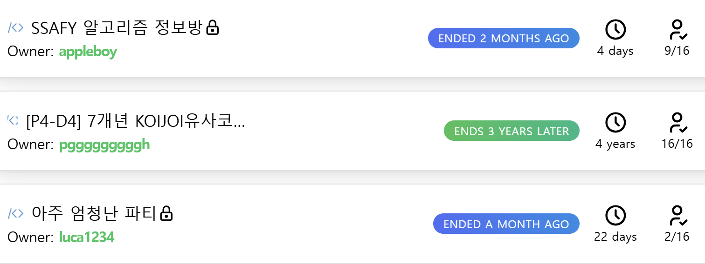
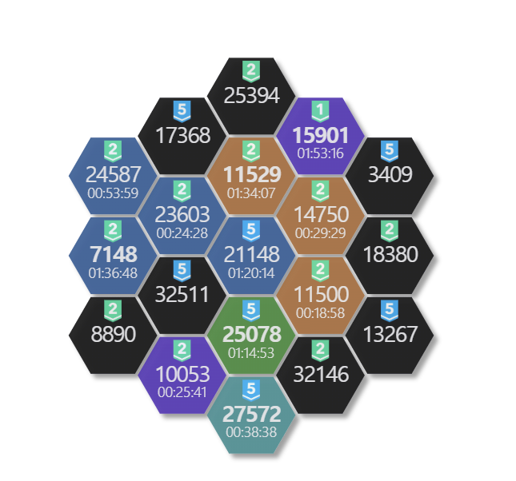
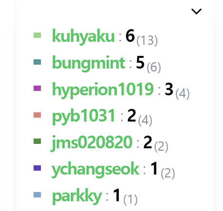

# Blobnom

**Blobnom: The First Territorial Competitive Programming Hub**

*Transform your algorithm practice on **various Online Judges** into an engaging game of territorial conquest!*

---

## Overview
[![Blobnom Screenshot][overview-image]](https://blobnom.xyz/)

[overview-image]: Assets/front.png

**Blobnom** introduces a game like layer to the challenging yet rewarding world of competitive programming. 

We understand that consistent practice, especially on platforms like [Baekjoon Online Judge](https://boj.kr) (BOJ), [Codeforces](https://codeforces.com/problemset) (CF) Archive can sometimes become monotonous. **Blobnom** aims to reignite the fun and competitive spirit by allowing users to "claim" algorithm problems as territories on a shared map.

 Solve problems, expand your domain, and compete with others in a persistent, visualized environment.

## Core Concept: Territorial Conquest

Imagine the vast collection of BOJ problems represented as hexagonal tiles on a world map. Blobnom brings this vision to life:

1.  **Start:** Join or create a Blobnom room and begin playing solo or with friends.  

2.  **Solve:** Be the first user to successfully solve a specific problem, and the corresponding hexagonal tile on the Blobnom map becomes your territory!  

3.  **Compete:** See the map updates in real time as users claim territories. Compete with friends and the community to build the largest empire and climb the leaderboards. Blobnom will give you realtime alerts.  

## Key Features

* 🗺️ **Hexagonal World Maps:** Explore algorithmic challenges visualized as territories on a unique hexagonal world map.
* ⚡ **Realtime Competition & Alerts:** Stay updated with real-time progress alerts and compete dynamically with friends or other players.
* 🔗 **Problems from Popular Judges:** Easily access problems from your favorite online judges, including Baekjoon Online Judge (BOJ) and Codeforces.
* 🎉 **Special Contests:** Participate in exclusive, time-limited events and contests integrated within the map experience.
* 🔍 **Advanced Problem Search:** Utilize a powerful search engine by [solved.ac query](https://solved.ac/en/search) to find problems matching specific criteria like difficulty, tags, and solve status (e.g., `solvable:true tier:b5..p5 %en !@your_id`). 

## Getting Started

Ready to start building your coding empire?

➡️ **Visit the live site:** [**https://blobnom.xyz/**](https://blobnom.xyz/)

Simply log in (integration with BOJ or Codeforces likely required) and start exploring the map to claim your first territory!

## Learn More

Dive deeper into the Blobnom project:

* **Official Website:** [https://blobnom.xyz/](https://blobnom.xyz/)
* **Project Documentation Hub (Notion):** [https://blobnom.notion.site/](https://blobnom.notion.site/) - Find comprehensive information, archives, and reference materials.
* **Development Insights (Notion):** [https://blobnom.notion.site/dev/](https://blobnom.notion.site/dev/) - Explore the tech stack, architecture, deployment strategy, and CI/CD details.
* **Planning & Vision (Notion):** [https://blobnom.notion.site/planning/](https://blobnom.notion.site/planning/) - Discover the concept design, roadmap, feature definitions, and UX/UI planning.